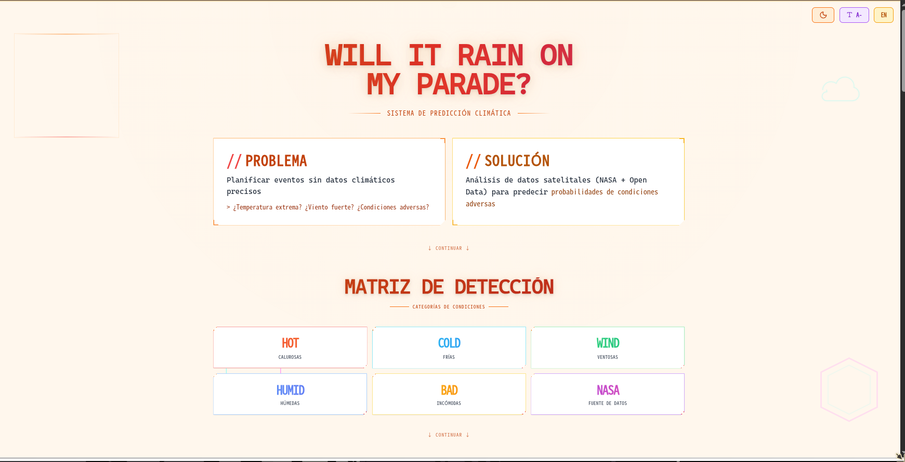

# Will It Rain On My Parade?


**Global Nominee — NASA Space Apps Challenge 2025** (entre 18.000+ equipos de 167 países)

Sistema de predicción climática basado en datos satelitales NASA y Open Data, diseñado para ayudar a planificar eventos al aire libre anticipando condiciones meteorológicas adversas.

**Demo en vivo:** [will-it-rain-on-my-parade-mu.vercel.app](https://will-it-rain-on-my-parade-mu.vercel.app/)

---

## Vista previa



---

## Sobre este repositorio

Este repositorio contiene el **frontend** del proyecto. El desarrollo está distribuido en tres repositorios:

| Parte | Repositorio |
|-------|-------------|
| Frontend (este repo) | [ShadeC0der/will-it-rain-on-my-parade](https://github.com/ShadeC0der/will-it-rain-on-my-parade) |
| Backend | _próximamente_ |
| Data Analysis | [benjobas/nasa-private](https://github.com/benjobas/nasa-private/tree/main/backend) |

---

## Características

- Interfaz bilingüe (ES/EN) con cambio dinámico
- Selector de ubicación con mapa interactivo (Leaflet)
- Selector de fecha y hora en formato 12h AM/PM
- Matriz de detección de condiciones: calor, frío, viento, humedad
- Panel de resultados con predicciones visuales evaluadas con **Brier Score**
- Historial de consultas persistido en localStorage
- Control de tamaño de fuente para accesibilidad
- Diseño responsive con estética cyberpunk
- Scroll suave con Lenis

---

## Cómo usar

```bash
npm install
npm run dev
```

Abre [http://localhost:5173](http://localhost:5173)

**Variables de entorno:**
```bash
# Copia frontend/.env.example a frontend/.env
VITE_API_URL=http://localhost:8000  # opcional, conecta con el backend
```

---

## Tecnologías

- React 19
- Vite
- TailwindCSS
- Leaflet + React Leaflet
- Lenis
- Lucide React

---

## Equipo — The Bugs Busters

Desarrollado para NASA Space Apps Challenge 2025.

| Integrante | Rol |
|------------|-----|
| Christian Gutiérrez ([@ShadeC0der](https://github.com/ShadeC0der)) | Frontend |
| Bastian Ojeda ([@zzonle](https://github.com/zzonle)) | Backend |
| Carla Barría ([@carlabdiaz](https://github.com/carlabdiaz)) | Backend |
| Nicolás Bahamonde ([@bbnadev](https://github.com/bbnadev)) | Testing |
| Benjamín Sánchez ([@benjobas](https://github.com/benjobas)) | Data Analysis |
